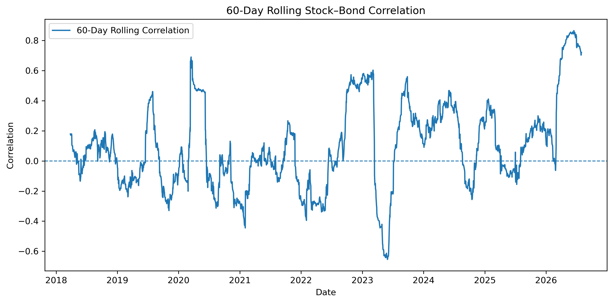
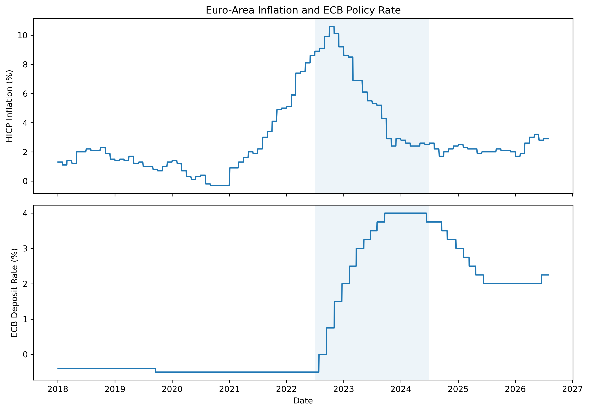
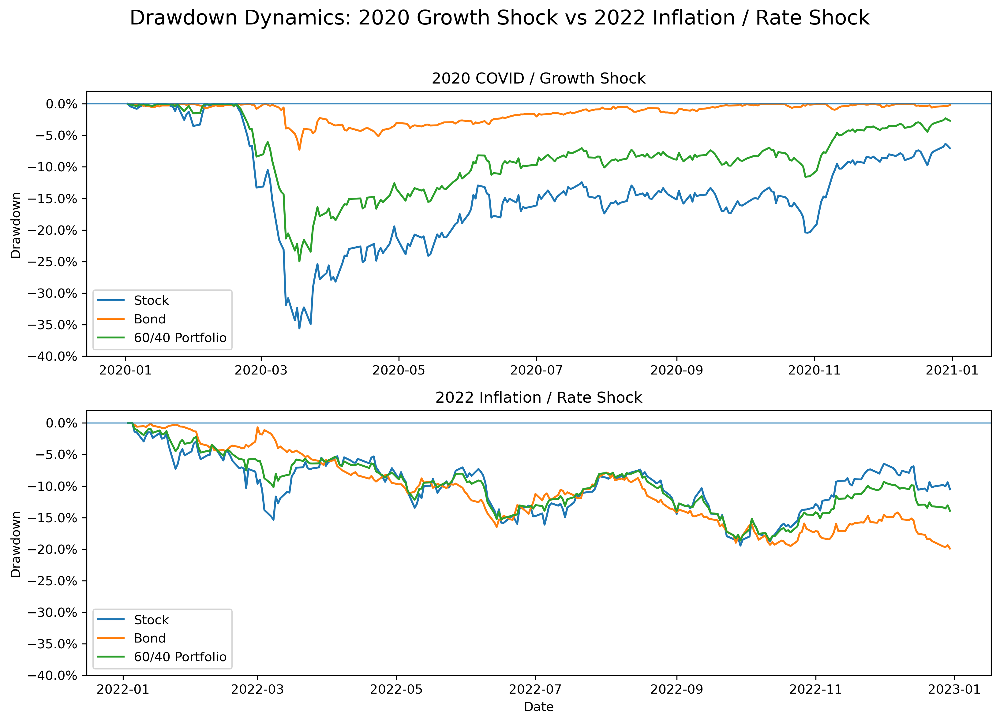
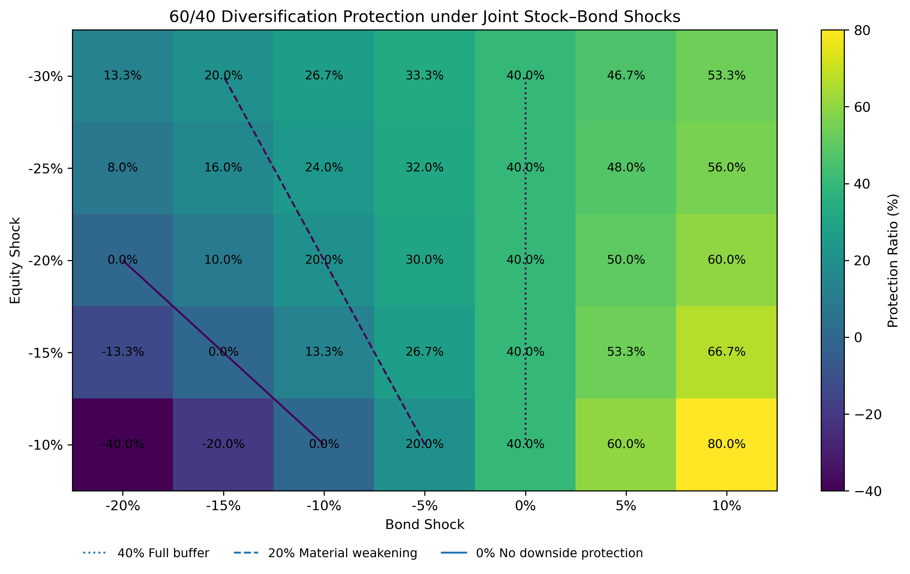

# Final Synthesis

## 1. Executive Summary

Traditional 60/40 portfolios rely on government bonds to reduce equity downside risk. This diversification benefit is often assessed through stock–bond correlation, but the 2022 inflation and monetary-tightening episode raises a broader question: can diversification weaken even when stock–bond correlation is not unusually high, simply because the bond allocation itself becomes materially riskier?

This project investigates when stock–bond diversification becomes less effective and which risk characteristics best explain the deterioration in portfolio protection. The analysis covers a European 60/40 portfolio from January 2018 to July 2026, using daily ETF market data together with euro-area HICP inflation and ECB policy-rate data.

The project begins with a correlation-based hypothesis: high inflation may weaken diversification by increasing stock–bond co-movement. The data do not support this simple mechanism. Across 4%, 5%, and 6% HICP thresholds, high-inflation observations do not exhibit higher stock–bond correlation. Correlation is descriptively higher during the ECB hiking regime, but the interaction effect is not statistically significant under HAC inference.

The central empirical puzzle emerges from the comparison between 2020 and 2022. Stock–bond correlation was approximately 0.30 in 2020 and only 0.12 in 2022, yet the 60/40 portfolio reduced equity maximum drawdown by approximately 10.63 percentage points in 2020 and only 0.81 percentage points in 2022. Lower correlation therefore did not translate into stronger diversification protection.

The key difference was the behavior of the bond sleeve. Bond annualized volatility increased from 6.34% in 2020 to 10.69% in 2022, bond maximum drawdown deteriorated from -7.29% to -20.29%, and the bond contribution to total portfolio variance increased from 2.0% to 11.7%. Tail-risk measures point in the same direction: bond VaR and Expected Shortfall increased, while the amount of tail-risk protection provided by the 60/40 portfolio declined.

The evidence therefore shifts the explanation from co-movement alone toward the defensive quality of the bond allocation itself. This interpretation remains intact under alternative rolling-correlation windows, inflation thresholds, and a second euro-area government-bond ETF.

The historical findings are finally translated into a forward-looking stress framework. The central stress variable is the relative severity of bond losses versus equity losses: as bond stress approaches equity stress, the protection normally provided by the 40% bond allocation approaches zero.

> **Diversification effectiveness depends not only on stock–bond co-movement, but also on whether the bond allocation retains its own defensive risk characteristics under the prevailing macroeconomic regime.**

## 2. Research Motivation and Question

Government bonds are traditionally used as the defensive component of balanced portfolios. Their role does not require them to rise whenever equities fall; it requires them to remain sufficiently stable that replacing part of the equity exposure with bonds reduces portfolio downside.

The 2022 inflation and monetary-tightening episode challenged this assumption. Rising inflation and higher interest rates placed pressure on both equities and government bonds, raising a more fundamental risk question:

> What happens when the asset intended to diversify equity risk becomes a meaningful source of risk itself?

The initial hypothesis was that high inflation weakened diversification mainly through higher stock–bond correlation. The empirical evidence did not support this simple explanation, which motivated a broader investigation of bond standalone risk and portfolio protection.

The final research question is therefore:

> **Under what conditions does stock–bond diversification become materially less effective, and which risk characteristics best explain the deterioration in portfolio protection?**

## 3. Data and Portfolio Setup

The analysis covers January 2018 to July 2026 and focuses on a European stock–bond allocation.

The equity sleeve is represented by the iShares Core MSCI Europe UCITS ETF (`IMAE.AS`), while the bond sleeve is represented by the iShares € Govt Bond 7–10yr UCITS ETF (`IBGM.AS`). Adjusted daily market prices are obtained from Yahoo Finance and converted into daily returns.

The bond ETF represents intermediate- to long-duration euro-area government bonds and therefore serves as the defensive component of the portfolio.

A constant-weight 60/40 benchmark is constructed as:

$$
R_{60/40,t}
=
0.6R_{Stock,t}
+
0.4R_{Bond,t}
$$

This provides a transparent benchmark for measuring how much downside protection the bond allocation adds relative to equities alone.

To connect portfolio behavior with the macroeconomic environment, the analysis incorporates two additional data sources:

- **Euro-area HICP inflation**, observed monthly and mapped to trading days within the same calendar month;
- **ECB policy-rate data**, used to identify the main monetary-tightening regime.

These variables are used to distinguish between inflation conditions and monetary-policy conditions rather than treating them as interchangeable macro signals.

The historical analysis focuses particularly on two economically distinct stress episodes:

- **2020 COVID / Growth Shock**
- **2022 Inflation / Rate Shock**

The purpose is to compare how the same portfolio structure behaves when bonds remain relatively defensive versus when the bond sleeve itself becomes stressed.

Finally, `X710.DE`, the Xtrackers II Eurozone Government Bond 7–10 UCITS ETF 1C, is used as an alternative bond proxy to test whether the 2020–2022 bond-risk pattern depends on the original ETF selection.

## 4. Analytical Framework

### 4.1 Dynamic Co-Movement

The analysis begins with stock–bond correlation because co-movement is the most direct measure of directional diversification.

Full-sample correlation provides a long-run benchmark, while 60-day rolling correlation captures changes in the relationship through time. A 120-day window is later used as a robustness check.

Correlation is useful but incomplete: it measures how stocks and bonds move together, but not whether bond losses themselves become large enough to undermine portfolio protection.

### 4.2 Macro-Regime Analysis

The next step tests whether changes in stock–bond correlation can be associated with the macroeconomic environment.

Inflation regimes are defined using HICP thresholds of 4%, 5%, and 6%, allowing the analysis to test whether the conclusion depends on the precise definition of “high inflation.”

Monetary-policy conditions are examined separately using the ECB hiking regime.

This separation matters because inflation and monetary tightening are related but not identical. A deterioration in diversification may reflect interest-rate repricing or bond-market stress rather than the level of inflation alone.

### 4.3 Historical Downside Comparison

Because correlation does not directly measure portfolio losses, the analysis next compares year-specific maximum drawdowns.

For 2020 and 2022, cumulative wealth is reset at the beginning of each year so that drawdowns are measured relative to the wealth path within that episode.

Diversification protection is defined as:

$$
\text{Protection}
=
|\operatorname{MaxDD}_{Stock}|
-
|\operatorname{MaxDD}_{60/40}|
$$

A larger value means that the 60/40 allocation absorbs a greater portion of the equity drawdown.

### 4.4 Beyond Correlation: Portfolio Risk Decomposition

The historical comparison then motivates a decomposition of portfolio variance:

$$
\sigma_P^2
=
w_S^2\sigma_S^2
+
w_B^2\sigma_B^2
+
2w_Sw_B\operatorname{Cov}(S,B)
$$

This separates three sources of portfolio risk:

- stock standalone risk;
- bond standalone risk;
- stock–bond covariance.

The decomposition allows the analysis to distinguish between two competing explanations for diversification deterioration: stronger co-movement or a materially riskier bond sleeve.

### 4.5 Tail-Risk Measurement

Maximum drawdown describes cumulative downside, while volatility describes overall dispersion. To test whether the same pattern also appears in extreme daily losses, the analysis adds historical 95% Value at Risk and Expected Shortfall.

VaR measures the loss threshold associated with the worst 5% of daily outcomes, while Expected Shortfall measures the average loss beyond that threshold.

Both metrics are calculated for stocks, bonds, and the 60/40 portfolio in 2020 and 2022.

### 4.6 Statistical Inference and Robustness

Descriptive regime evidence is complemented by an interaction regression:

$$
R_{B,t}
=
\alpha
+
\beta_1R_{S,t}
+
\beta_2H_t
+
\beta_3(R_{S,t}H_t)
+
\varepsilon_t
$$

where \(H_t\) identifies the ECB hiking regime.

HAC standard errors with five lags are used to reduce the risk of overstating statistical significance in daily financial-return data.

The regression tests association rather than causality.

Three robustness checks are then used to assess specification dependence:

- 60-day versus 120-day rolling correlations;
- 4%, 5%, and 6% inflation thresholds;
- an alternative euro-area government-bond ETF.

## 5. Empirical Findings

### 5.1 Time-Varying Stock–Bond Diversification

Across the full 2018–2026 sample, daily stock–bond correlation is approximately 0.14. The 60-day rolling series, however, moves repeatedly between negative and positive territory.

The long-run average therefore masks substantial regime variation. Stock–bond correlation should be treated as a dynamic portfolio characteristic rather than a stable measure of diversification quality.

*Figure 1. 60-Day rolling correlation between European equity and euro-area government-bond daily returns. The repeated movement between negative and positive correlation shows that diversification conditions vary materially through time.*

### 5.2 Inflation and Monetary-Policy Regimes

The initial hypothesis was that higher inflation would weaken diversification by increasing stock–bond correlation.

*Figure 2. Euro-area HICP inflation and the ECB deposit rate over the sample period. The figure provides macroeconomic context for the 2022 inflation and monetary-tightening episode and is not interpreted as causal evidence of diversification deterioration.*

The data do not support this mechanism. Across 4%, 5%, and 6% HICP thresholds, high-inflation observations consistently exhibit lower—not higher—stock–bond correlation than normal-inflation observations.

This does not imply that inflation improves diversification. It shows that the level of inflation alone is insufficient to explain the 2022 deterioration.

Monetary-policy conditions provide a different descriptive signal. Stock–bond correlation is approximately 0.224 during the ECB hiking regime versus 0.133 outside the hiking period, a difference of roughly 0.09.

This points toward a stronger positive stock–bond relationship during monetary tightening, but descriptive correlation alone cannot establish whether this difference is statistically reliable.

### 5.3 Statistical Evidence

The interaction regression estimates a stock–bond slope of approximately 0.046 outside the hiking regime and 0.173 during tightening.

| Regression Result | Estimate |
|---|---:|
| Non-hiking slope | 0.046 |
| Hiking slope | 0.173 |
| Interaction coefficient | 0.127 |
| HAC p-value | 0.23 |
| 95% CI | -0.080 to 0.334 |

The interaction coefficient is positive, but the confidence interval includes zero and the HAC p-value is approximately 0.23.

The result is therefore **directionally consistent with the descriptive evidence, but does not statistically confirm a distinct hiking-regime effect**.

This is an important turning point. Neither high inflation nor the ECB hiking regime provides a sufficiently strong correlation-based explanation for the weak diversification observed in 2022.

The analysis therefore moves from **how stocks and bonds co-move** to **how much risk the bond sleeve itself contributes**.

### 5.4 2020 vs 2022 Historical Contrast

The 2020–2022 comparison provides the central empirical puzzle.

The two episodes represent different macroeconomic environments. Average euro-area HICP inflation was approximately 0.37% in 2020 and 8.05% in 2022: 2020 was primarily a growth and risk-off shock, while 2022 combined high inflation with rapid monetary tightening.

| Metric | 2020 | 2022 |
|---|---:|---:|
| Stock–Bond Correlation | 0.30 | 0.12 |
| Stock Max Drawdown | -35.60% | -19.44% |
| Bond Max Drawdown | -7.29% | -20.29% |
| 60/40 Max Drawdown | -24.97% | -18.64% |
| 60/40 Protection | 10.63 pp | 0.81 pp |

*Figure 3. Year-specific drawdown dynamics during the 2020 COVID / Growth Shock and the 2022 Inflation / Rate Shock. In 2020, bonds remained comparatively resilient during severe equity losses, allowing the 60/40 portfolio to materially reduce drawdown. In 2022, bond drawdowns became comparable in severity to equity drawdowns, sharply weakening the portfolio's defensive benefit.*

The result is counterintuitive: stock–bond correlation was substantially higher in 2020, yet diversification protection was far stronger.

In 2020, equities experienced a maximum drawdown of approximately -35.60%, while bond drawdown remained limited to -7.29%. The 60/40 portfolio therefore reduced equity drawdown by approximately 10.63 percentage points.

In 2022, equity drawdown was smaller at -19.44%, but bond drawdown reached -20.29%. Portfolio protection fell to only 0.81 percentage points.

If correlation were the dominant driver of diversification effectiveness, the higher-correlation 2020 episode should have produced weaker protection. The opposite occurred.

The distinguishing feature was therefore the bond sleeve. In 2020, bonds remained relatively resilient. In 2022, bond downside severity became comparable to equity downside severity.

This shifts the explanation from **co-movement risk** toward **bond standalone risk**.

### 5.5 Beyond Correlation: Bond Standalone Risk

The change becomes clearer when volatility and portfolio-risk contributions are compared.

| Risk Metric | 2020 | 2022 |
|---|---:|---:|
| Stock Volatility | 28.35% | 18.70% |
| Bond Volatility | 6.34% | 10.69% |
| Bond Variance Contribution | 2.0% | 11.7% |
| Covariance Contribution | 7.9% | 7.5% |

The 2022 episode was not simply a more volatile market environment. Equity volatility was substantially lower than in 2020, while bond volatility increased from 6.34% to 10.69%.

More importantly, the bond contribution to total 60/40 variance increased from approximately 2.0% to 11.7%.

The covariance contribution remained broadly stable at around 8%, and annualized stock–bond covariance was lower in 2022 than in 2020.

The composition of portfolio risk therefore changed. In 2020, portfolio variance remained overwhelmingly equity-driven and bonds contributed little standalone risk. In 2022, the bond allocation itself became a materially larger source of risk.

This provides the strongest explanation for the deterioration in diversification: the defensive asset became substantially less defensive, even though stock–bond co-movement did not become more extreme.

### 5.6 Tail-Risk Evidence

VaR and Expected Shortfall provide an independent test of the same mechanism.

| Metric | 2020 | 2022 |
|---|---:|---:|
| Bond VaR 95% | 0.50% | 1.07% |
| Bond ES 95% | 0.99% | 1.31% |
| VaR Protection | 1.33 pp | 0.58 pp |
| ES Protection | 1.68 pp | 0.87 pp |

Bond VaR more than doubled from 0.50% to 1.07%, while bond Expected Shortfall increased from 0.99% to 1.31%. These values indicate that extreme daily bond losses became materially larger in 2022.

At the same time, the protection delivered by the 60/40 portfolio weakened. VaR protection fell from 1.33 to 0.58 percentage points, while ES protection declined from 1.68 to 0.87 percentage points.

This deterioration did not result from more severe equity tail risk. Stock VaR fell from 3.21% in 2020 to 1.82% in 2022, and stock Expected Shortfall fell from 4.73% to 2.61%.

The tail-risk evidence therefore confirms the broader result: diversification did not disappear completely in 2022, but its protective effectiveness weakened substantially because the bond sleeve itself became more vulnerable to downside risk.

## 6. Robustness Checks

The main findings remain intact under alternative specifications.

Using a 120-day instead of a 60-day rolling-correlation window preserves the conclusion that stock–bond correlation is materially time-varying, while producing a smoother series.

The inflation result is also stable across 4%, 5%, and 6% HICP thresholds: high-inflation observations consistently exhibit lower stock–bond correlation than normal-inflation observations. The rejection of a simple “high inflation → higher correlation” mechanism is therefore not driven by one threshold choice.

Finally, the alternative bond ETF `X710.DE` reproduces the same deterioration in bond risk. Its annualized volatility increases from approximately 8.36% in 2020 to 10.65% in 2022, while maximum drawdown deteriorates from approximately -8.33% to -19.58%.

The exact estimates vary, but the central interpretation survives: the 2022 deterioration is more consistently associated with weaker bond defensiveness than with a simple increase in stock–bond correlation.

## 7. Historical and Forward Stress Framework

### 7.1 Historical Stress Archetypes

The empirical results can be summarized as two distinct stress structures.

**2020 COVID / Growth Shock:** equity losses dominated while government bonds remained comparatively resilient. The bond maximum drawdown of -7.29% was only about one-fifth of the -35.60% equity drawdown.

**2022 Inflation / Rate Shock:** bond downside severity became comparable to equity downside severity, with maximum drawdowns of approximately -20.29% and -19.44%, respectively.

These observations suggest two different diversification environments:

- **Equity-dominated stress:** bonds remain defensive and absorb part of the equity shock.
- **Joint stock–bond stress:** the diversifier itself becomes a material source of loss.

Because stock and bond maximum drawdowns may occur on different dates, these historical ratios are used only as severity references rather than simultaneous historical shocks.

### 7.2 Forward Scenario Sensitivity

The historical insight is translated into a deterministic forward-looking stress framework.

The scenario grid evaluates equity shocks from -10% to -30% and bond shocks from +10% to -20%.

For each simultaneous shock combination:

$$
S_P
=
0.6S_E
+
0.4S_B
$$

where \(S_E\), \(S_B\), and \(S_P\) denote the equity, bond, and 60/40 portfolio shocks.

The framework does not forecast future returns or assign probabilities. Its purpose is to measure how portfolio protection changes as the severity of bond stress changes relative to equity stress.

### 7.3 Reverse Stress Indicator

The relative severity of bond stress is summarized using the Bond Stress Ratio:

$$
BSR
=
\frac{|S_B|}{|S_E|}
$$

For simultaneous negative equity and bond shocks, the corresponding Protection Ratio is:

$$
PR
=
0.4(1-BSR)
$$

*Figure 4. Protection Ratio of a 60/40 portfolio across simultaneous equity and bond stress scenarios. Diversification weakens as bond losses increase relative to equity losses: the 40% flat-bond benchmark falls toward zero protection as the Bond Stress Ratio approaches one.*

This produces a direct reverse-stress interpretation:

| Bond Stress Ratio | Protection Ratio | Interpretation |
|---:|---:|---|
| 0 | 40% | Bonds remain flat; full mechanical buffer |
| 0.5 | 20% | Diversification materially weakened |
| 1.0 | 0% | No downside protection relative to equities |
| > 1.0 | < 0% | Bonds amplify portfolio loss |

The 20% Protection Ratio is a project-specific analytical reference point rather than an external industry standard.

The relationship shows that equity-shock severity alone does not determine diversification effectiveness. What matters is how much bond stress accompanies the equity shock.

### 7.4 Risk Interpretation

The historical and forward-looking results point to the same risk mechanism.

A severe equity shock can remain partially diversified if bonds retain defensive characteristics. Conversely, even a less severe equity shock can produce weak 60/40 protection when bond losses become comparable to equity losses.

The 2020 historical stress ratio is approximately 0.20, consistent with a strongly asymmetric stock–bond stress environment. The 2022 ratio is approximately 1.04, indicating that annual bond downside severity was roughly comparable to equity downside severity.

These historical values are not inserted directly into the simultaneous-shock formula; they serve only as empirical reference points.

The principal forward-looking warning signal is therefore:

> **Bond stress is rising relative to equity stress.**

## 8. Risk Management Implications

The analysis suggests that diversification monitoring should extend beyond correlation and be organized around three complementary dimensions.

**1. Co-movement risk**

Rolling correlation and covariance capture whether stocks and bonds are increasingly moving together. They remain useful indicators, but the 2020–2022 comparison shows that they are not sufficient to assess diversification quality.

**2. Bond standalone risk**

Bond volatility, drawdown, VaR, Expected Shortfall, and variance contribution measure whether the defensive allocation itself is becoming a material source of risk.

This dimension is particularly important because a low stock–bond correlation can coexist with weak diversification if bond losses become sufficiently large.

**3. Relative stress severity**

The Bond Stress Ratio captures whether bond stress is approaching equity stress under hypothetical joint scenarios.

This converts the historical finding into a forward-looking portfolio-risk signal.

Macroeconomic regimes should therefore be interpreted through their effect on asset-level risk rather than through labels such as “high inflation” or “rate hikes” alone.

For practical stress testing, the implication is equally clear: equity shocks should not be evaluated in isolation. The defensive capacity of the bond sleeve must be stressed simultaneously.

## 9. Limitations

The analysis has four main limitations.

First, ETFs are used as investable proxies for European equities and euro-area government bonds. The alternative bond ETF reduces, but does not eliminate, instrument-specific dependence.

Second, the 2018–2026 sample contains only a limited number of major macro-financial regimes. The 2020–2022 contrast is economically informative but cannot represent every possible future growth, inflation, monetary-policy, liquidity, or sovereign-risk shock.

Third, the macro-regime evidence is primarily descriptive. The ECB hiking interaction is not statistically significant under HAC inference, so the analysis does not establish a causal effect of monetary tightening on stock–bond co-movement. The HICP regime classification also captures realized inflation levels rather than inflation surprises or market expectations.

Finally, the forward-looking framework is deterministic rather than probabilistic. It measures portfolio sensitivity to assumed simultaneous shocks but does not estimate their likelihood. Historical Bond Stress Ratios based on year-specific maximum drawdowns are therefore used only as severity anchors.

## 10. Final Conclusion

The project began with a correlation-based hypothesis: high inflation might weaken stock–bond diversification by increasing co-movement.

The evidence did not support this simple mechanism. High-inflation regimes did not exhibit higher correlation, and the stronger relationship observed during ECB tightening was suggestive rather than statistically confirmed.

The decisive evidence came from the 2020–2022 comparison. Stock–bond correlation was higher in 2020, yet the 60/40 portfolio delivered substantially stronger downside protection. This contradiction shifted the analysis toward the defensive quality of the bond sleeve.

Across drawdown, volatility, portfolio-risk decomposition, VaR, and Expected Shortfall, the same pattern emerged: the bond allocation became materially riskier in 2022. Its variance contribution increased sharply, while covariance did not become the dominant source of portfolio risk.

The historical evidence therefore supports a broader view of diversification risk. Weak diversification does not require unusually high correlation; it can also arise when the asset intended to provide protection loses its own defensive characteristics.

The forward-looking stress framework translates this insight into a practical monitoring rule: diversification protection deteriorates as bond stress approaches equity stress.

> **Diversification effectiveness depends not only on stock–bond co-movement, but also on whether the bond allocation retains its own defensive risk characteristics under the prevailing macroeconomic regime.**